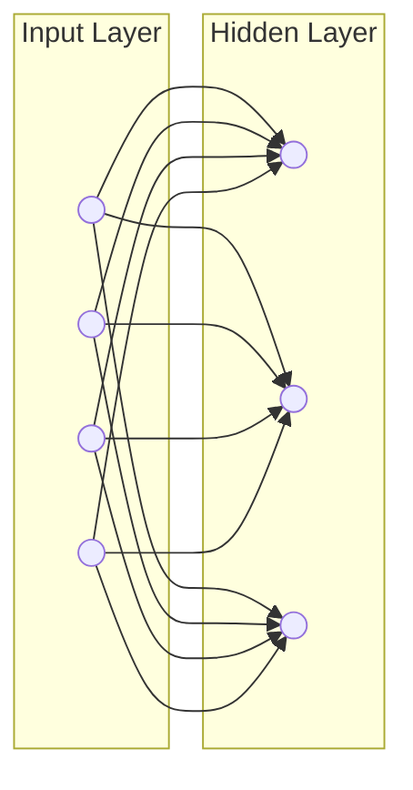
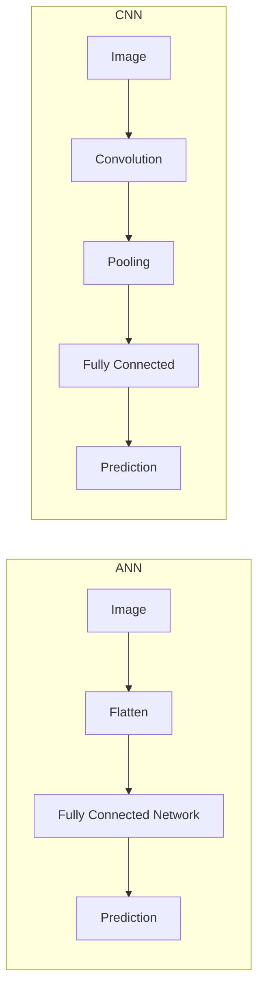
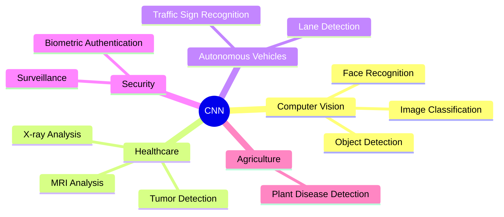

# Limitations of Artificial Neural Networks (ANN) and the Need for Convolutional Neural Networks (CNN)

> Why ANN is insufficient for image processing and how CNN overcomes its limitations.

---

# 1. Introduction

Artificial Neural Networks (ANNs), especially **Multilayer Perceptrons (MLPs)**, are powerful models for solving classification and regression problems. However, when dealing with **high-dimensional data** such as images, videos, and medical scans, traditional ANNs face several challenges.

These limitations motivated the development of **Convolutional Neural Networks (CNNs)**, which are specifically designed to process spatial data efficiently.

---

# 2. Limitations of ANN

## 1. Large Number of Parameters

In a fully connected ANN, **every neuron is connected to every neuron in the next layer**.

For an image of size **224 × 224 × 3**,

- Input neurons = **150,528**
- Hidden layer = **1,000 neurons**

Number of weights:

\[
150,528 \times 1,000 = 150,528,000
\]

More than **150 million parameters** are required for just one hidden layer.

### Illustration



### Problems

- Huge memory requirement
- Slow training
- High computational cost

---

# 2. Does Not Preserve Spatial Information

ANN converts an image into a **1D vector**, causing the spatial relationship between neighboring pixels to be lost.

Example

Original Image

```text
⬛ ⬛ ⬜
⬜ ⬛ ⬜
⬜ ⬜ ⬛
```

Flattened Input

```text
1 1 0 0 1 0 0 0 1
```

After flattening,

- Position information is lost.
- Neighboring pixels are no longer recognized.

---

# 3. Poor Performance on Images

ANN treats every pixel as an independent feature.

It cannot naturally detect:

- Edges
- Corners
- Shapes
- Textures
- Objects

Therefore, image recognition accuracy is limited.

---

# 4. High Risk of Overfitting

Large numbers of parameters increase model complexity.

Consequences:

- Learns noise instead of patterns.
- Poor generalization.
- Performs poorly on unseen data.

---

# 5. Computationally Expensive

ANN requires:

- Large RAM
- Powerful CPUs/GPUs
- Long training time

Especially for high-resolution images.

---

# 6. Ignores Local Features

Suppose an image contains a cat.

ANN processes every pixel independently.

It does **not understand** that nearby pixels together form:

- Eyes
- Nose
- Ears
- Fur texture

---

# 7. Sensitive to Image Transformations

Small changes such as

- Rotation
- Translation
- Scaling

can significantly affect ANN predictions because the flattened representation changes.

---

# Summary of ANN Limitations

| Limitation                   | Impact                   |
| ---------------------------- | ------------------------ |
| Too many parameters          | High memory usage        |
| Fully connected architecture | Slow training            |
| Image flattening             | Spatial information lost |
| Cannot learn local features  | Poor image recognition   |
| High overfitting risk        | Poor generalization      |
| Expensive computation        | Longer training time     |
| Sensitive to transformations | Reduced robustness       |

---

# 3. Why Do We Need CNN?

CNN was developed specifically to overcome the limitations of fully connected ANNs for image and spatial data.

CNN introduces three key ideas:

- Local Receptive Fields
- Weight Sharing
- Pooling

These innovations dramatically reduce parameters while preserving spatial information.

---

# ANN vs CNN



---

# How CNN Solves ANN's Problems

## 1. Preserves Spatial Information

CNN processes images as **2D matrices**, preserving the arrangement of neighboring pixels.

Instead of flattening immediately, CNN extracts meaningful local patterns.

---

## 2. Learns Local Features

Convolution filters automatically detect:

```text
Edges
↓

Corners
↓

Textures
↓

Shapes
↓

Objects
```

### Feature Hierarchy


---

## 3. Uses Weight Sharing

Instead of learning millions of different weights,

CNN applies the **same filter** across the entire image.

Benefits:

- Far fewer parameters
- Lower memory usage
- Faster training

---

## 4. Uses Local Receptive Fields

Each neuron looks at only a **small region** of the image.

Example:

Instead of processing

```
224 × 224 pixels
```

a neuron may process only

```
3 × 3
```

or

```
5 × 5
```

pixels.

This captures local patterns efficiently.

---

## 5. Uses Pooling Layers

Pooling reduces image dimensions while preserving important information.

Example

```text
Feature Map

8 × 8

↓

Max Pooling

↓

4 × 4
```

Benefits

- Less computation
- Reduced overfitting
- Better generalization

---

## 6. Better Translation Invariance

CNN can recognize an object even if it moves slightly within the image.

Example

Cat at:

- Left side
- Center
- Right side

CNN still identifies it correctly.

---

## 7. Better Accuracy

CNN consistently outperforms traditional ANN on image-related tasks such as:

- Face Recognition
- Medical Imaging
- Object Detection
- Handwriting Recognition
- Autonomous Driving

---

# Comparison: ANN vs CNN

| Feature                | ANN              | CNN                             |
| ---------------------- | ---------------- | ------------------------------- |
| Architecture           | Fully Connected  | Convolution + Pooling           |
| Input                  | Flattened Vector | 2D/3D Image                     |
| Spatial Information    | Lost             | Preserved                       |
| Parameters             | Very High        | Much Lower                      |
| Feature Learning       | Manual / Limited | Automatic Hierarchical Features |
| Weight Sharing         | NO               | Yes                             |
| Local Receptive Fields | NO               | Yes                             |
| Translation Invariance | NO               | Yes                             |
| Training Speed         | Slower           | Faster                          |
| Image Recognition      | Moderate         | Excellent                       |

---

# Real-World Applications of CNN



---

# Key Points

1. ANN uses **fully connected layers**, resulting in a very large number of parameters.
2. Flattening images causes the loss of spatial information.
3. ANN cannot efficiently learn local image features such as edges and textures.
4. CNN introduces **convolution**, **weight sharing**, and **pooling**.
5. Weight sharing drastically reduces the number of trainable parameters.
6. Local receptive fields help CNN learn meaningful local patterns.
7. Pooling reduces computation and improves generalization.
8. CNN preserves spatial relationships between pixels.
9. CNN achieves significantly better performance than ANN on image-related tasks.
10. CNN is the standard architecture for modern computer vision applications.

---

# Conclusion

Artificial Neural Networks are effective for many structured-data problems but become inefficient for image processing because they require millions of parameters, lose spatial information through flattening, and struggle to learn local visual patterns. Convolutional Neural Networks address these issues using **convolutional filters, weight sharing, local receptive fields, and pooling layers**, making them computationally efficient and highly accurate for image recognition. Consequently, CNNs have become the foundation of modern computer vision systems, powering applications such as facial recognition, medical image analysis, autonomous vehicles, and object detection.
