# Artificial Neural Networks (ANN)

> **Exam Focus:** Definition, Architecture, Working, XOR Problem, Advantages over Traditional Machine Learning

---

# 1. Introduction

An **Artificial Neural Network (ANN)** is a computational model inspired by the **biological neurons** in the human brain. It consists of interconnected artificial neurons that learn patterns from data by adjusting weights during training.

Unlike traditional machine learning algorithms that rely on manually engineered features, ANNs automatically learn features and complex nonlinear relationships directly from data.

---

# 2. Biological Neuron vs Artificial Neuron

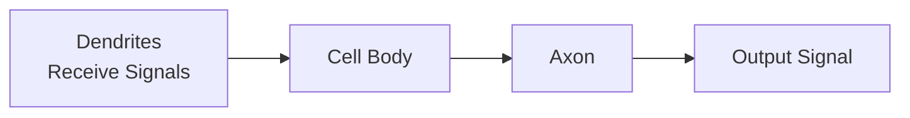

↓

Equivalent Artificial Neuron

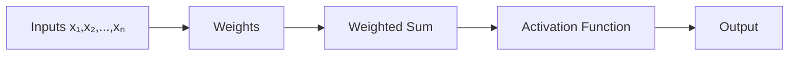

---

# 3. ANN Architecture

An ANN consists of three major layers.

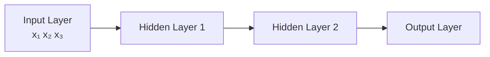

## Components

### 1. Input Layer

- Receives the input features.
- No computation is performed.

Example:

```
Age
Salary
Experience
```

---

### 2. Hidden Layer

- Performs mathematical computations.
- Learns patterns.
- More hidden layers → Deep Learning.

Each neuron computes

\[
z=\sum (w_ix_i)+b
\]

then

\[
a=f(z)
\]

where

- **w** = weights
- **b** = bias
- **f** = activation function

---

### 3. Output Layer

Produces final prediction.

Examples

| Problem           | Output           |
| ----------------- | ---------------- |
| Spam Detection    | Spam / Not Spam  |
| Digit Recognition | 0–9              |
| House Price       | Continuous Value |

---

# 4. Structure of a Neuron

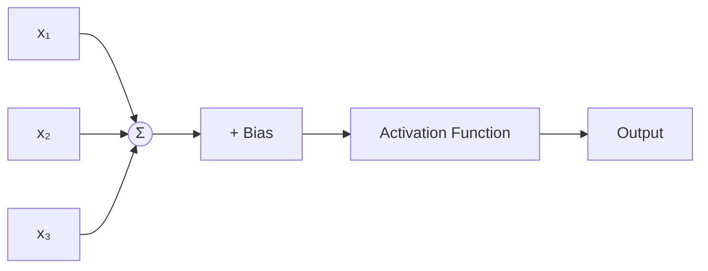

Mathematically,

\[
Output=f(\sum w_ix_i+b)
\]

---

# 5. Activation Functions

Activation functions introduce **non-linearity**, allowing ANN to learn complex patterns.

---

## (a) Sigmoid

\[
\sigma(x)=\frac1{1+e^{-x}}
\]

Output:

```
0 → 1
```

Used for:

- Binary Classification

---

## (b) ReLU (Most Common)

\[
ReLU(x)=max(0,x)
\]

Advantages

- Fast
- Prevents vanishing gradient
- Computationally efficient

---

## (c) Tanh

Output Range

```
-1 → +1
```

Better than sigmoid because it is zero-centered.

---

## (d) Softmax

Converts outputs into probabilities.

Used for:

- Multi-class Classification

---

# 6. Forward Propagation

Information flows from input to output.

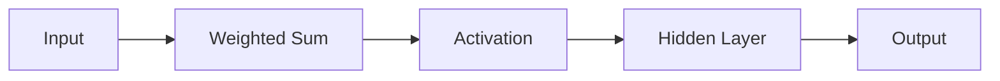

Steps

1. Receive input
2. Multiply by weights
3. Add bias
4. Apply activation function
5. Produce prediction

---

# 7. Loss Function

Loss measures prediction error.

Examples

| Problem               | Loss Function             |
| --------------------- | ------------------------- |
| Regression            | Mean Squared Error (MSE)  |
| Binary Classification | Binary Cross Entropy      |
| Multi-class           | Categorical Cross Entropy |

Goal

```
Minimize Loss
```

---

# 8. Backpropagation

Backpropagation updates weights to reduce prediction error.

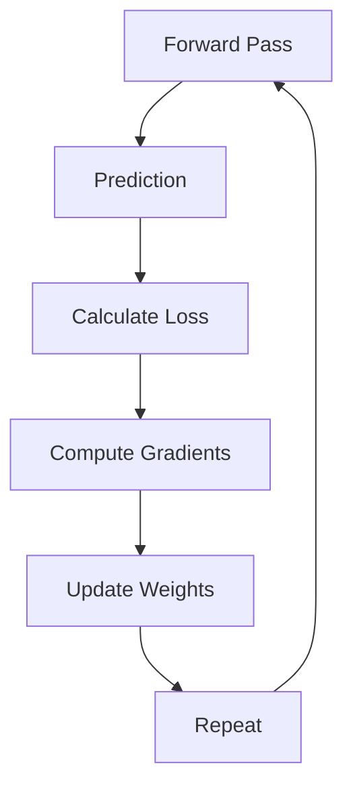

Weight Update Formula

\[
W*{new}=W*{old}-\eta \frac{\partial L}{\partial W}
\]

where

- η = Learning Rate

---

# 9. ANN Training Process

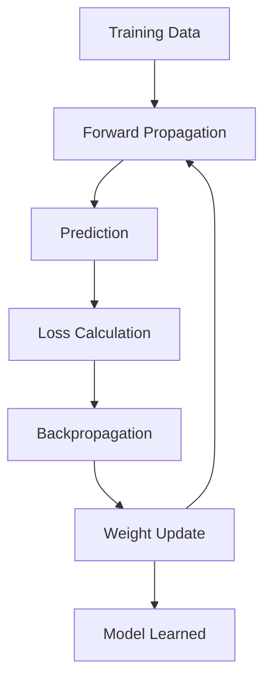

---

# 10. Traditional Machine Learning vs ANN

| Traditional ML                     | Artificial Neural Network                    |
| ---------------------------------- | -------------------------------------------- |
| Manual feature engineering         | Automatic feature learning                   |
| Mostly linear relationships        | Learns nonlinear relationships               |
| Performs well on structured data   | Excellent for structured & unstructured data |
| Small number of parameters         | Millions of trainable parameters             |
| Simpler models                     | Deep hierarchical models                     |
| Limited accuracy for complex tasks | High accuracy on complex tasks               |

---

# 11. Why ANN Wins Over Traditional ML

Traditional machine learning algorithms struggle when the relationship between inputs and outputs becomes highly nonlinear or when the dataset contains complex patterns.

ANN overcomes these limitations because it:

- Learns nonlinear relationships
- Automatically extracts features
- Handles images, speech, and text
- Improves with more data
- Learns hierarchical representations
- Generalizes well after training

---

# 12. XOR Problem

The XOR problem demonstrated the biggest limitation of early neural networks.

## XOR Truth Table

| x₁  | x₂  | XOR |
| --- | --- | --- |
| 0   | 0   | 0   |
| 0   | 1   | 1   |
| 1   | 0   | 1   |
| 1   | 1   | 0   |

---

## XOR Visualization

<p align="center">
  
</p>

Observe:

The two classes are diagonally opposite.

A single straight line **cannot separate them**.

---

# 13. Why Traditional ML Fails on XOR

Algorithms like

- Linear Regression
- Logistic Regression
- Perceptron
- Linear SVM

learn only a **linear decision boundary**.

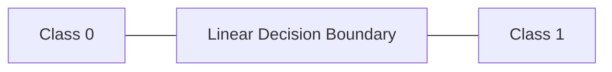

For XOR,

No straight line can correctly classify all four points.

Therefore,

**Single-layer Perceptron fails.**

---

# 14. How ANN Solves XOR

ANN introduces

- Hidden Layer
- Nonlinear Activation Function

These transform the data into a new feature space where XOR becomes linearly separable.

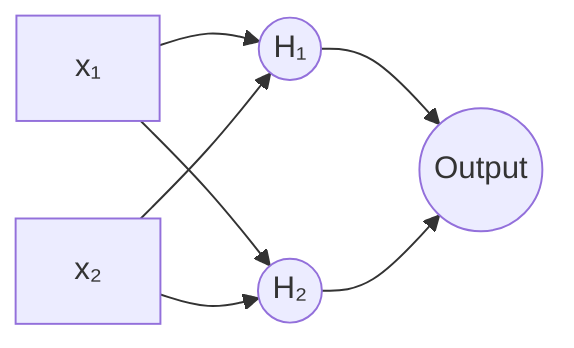

Hidden neurons learn intermediate logical relationships.

Finally,

Output neuron combines them to correctly compute XOR.

---

# 15. XOR Learning Process

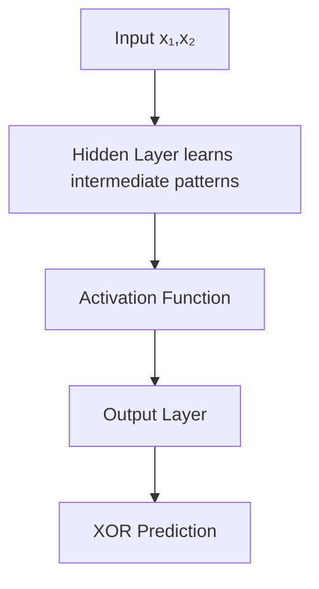

---

# 16. Comparison on XOR

| Algorithm               | Solves XOR? | Reason                              |
| ----------------------- | ----------- | ----------------------------------- |
| Linear Regression       | NO          | Linear model                        |
| Logistic Regression     | NO          | Linear boundary                     |
| Single-layer Perceptron | NO          | No hidden layer                     |
| Decision Tree           | Yes         | Nonlinear splits                    |
| Random Forest           | Yes         | Ensemble learning                   |
| XGBoost                 | Yes         | Gradient boosting                   |
| ANN (MLP)               | Yes         | Hidden layer + nonlinear activation |

---

# 17. Advantages of ANN

- Automatically learns features
- Handles nonlinear data
- High prediction accuracy
- Scales to large datasets
- Supports Deep Learning
- Robust for image, speech, and NLP tasks
- Can approximate almost any continuous function (Universal Approximation Theorem)

---

# 18. Limitations of ANN

- Requires large datasets
- Computationally expensive
- Long training time
- Difficult to interpret (Black Box)
- Requires GPUs for deep networks
- Hyperparameter tuning can be challenging

---

# 19. Applications

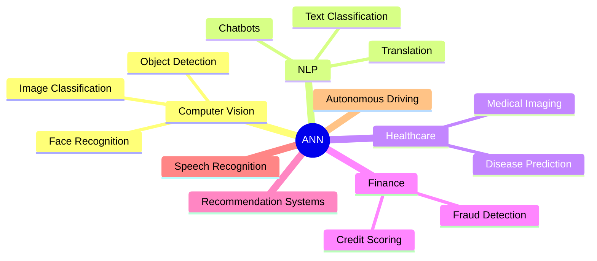

---

# 20. Key Points

1. ANN is inspired by biological neurons.
2. ANN consists of Input, Hidden, and Output layers.
3. Hidden layers enable learning of complex patterns.
4. Activation functions introduce nonlinearity.
5. Forward propagation computes predictions.
6. Backpropagation updates weights using gradients.
7. ANN automatically learns features from data.
8. Traditional ML relies on manual feature engineering.
9. XOR is **not linearly separable**.
10. A **Single-layer Perceptron cannot solve XOR**.
11. A **Multilayer Perceptron (MLP)** with at least one hidden layer and a nonlinear activation function successfully solves XOR.

---

# 21. Conclusion

Artificial Neural Networks marked a significant advancement over traditional machine learning by enabling models to learn complex nonlinear relationships directly from data. The **XOR problem** is the classical example illustrating this breakthrough: while linear models fail because XOR is not linearly separable, a **multilayer perceptron (MLP)** equipped with hidden layers and nonlinear activation functions can correctly classify the XOR outputs. This capability forms the foundation of modern deep learning systems used in computer vision, natural language processing, healthcare, finance, robotics, and many other AI applications.
